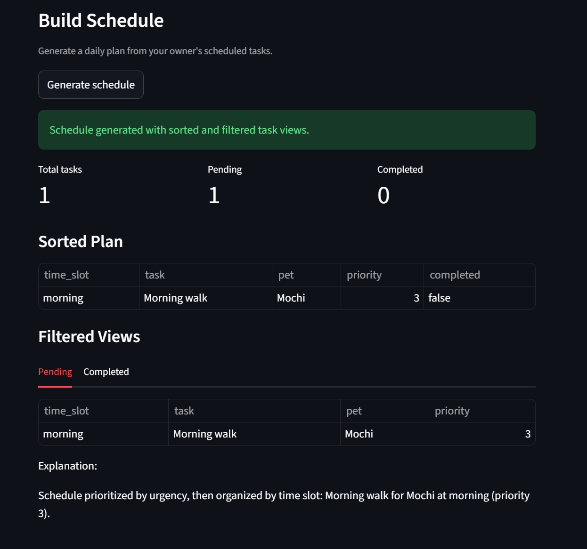

# PawPal+ (Module 2 Project)

You are building **PawPal+**, a Streamlit app that helps a pet owner plan care tasks for their pet.

## Scenario

A busy pet owner needs help staying consistent with pet care. They want an assistant that can:

- Track pet care tasks (walks, feeding, meds, enrichment, grooming, etc.)
- Consider constraints (time available, priority, owner preferences)
- Produce a daily plan and explain why it chose that plan

Your job is to design the system first (UML), then implement the logic in Python, then connect it to the Streamlit UI.

## What you will build

Your final app should:

- Let a user enter basic owner + pet info
- Let a user add/edit tasks (duration + priority at minimum)
- Generate a daily schedule/plan based on constraints and priorities
- Display the plan clearly (and ideally explain the reasoning)
- Include tests for the most important scheduling behaviors

## Getting started

### Setup

```bash
python -m venv .venv
source .venv/bin/activate  # Windows: .venv\Scripts\activate
pip install -r requirements.txt
```

### Suggested workflow

1. Read the scenario carefully and identify requirements and edge cases.
2. Draft a UML diagram (classes, attributes, methods, relationships).
3. Convert UML into Python class stubs (no logic yet).
4. Implement scheduling logic in small increments.
5. Add tests to verify key behaviors.
6. Connect your logic to the Streamlit UI in `app.py`.
7. Refine UML so it matches what you actually built.

## Smarter Scheduling
Here’s a summary of the new features now in your PawPal scheduler:

1. Recurring task support
- Tasks now support recurrence values: `none`, `daily`, and `weekly`.
- Validation happens at creation time so invalid recurrence values are rejected.
- Implemented in pawpal_system.py.

2. Due dates for recurring tasks
- `daily` and `weekly` tasks require a `due_date`.
- Marking a recurring task complete creates a new task instance with the next due date calculated using `timedelta`:
- Daily: +1 day
- Weekly: +7 days
- Implemented in pawpal_system.py.

3. Completion workflow helper
- Added `mark_task_complete` on `User` as a wrapper around completion logic.
- It marks the current task complete and auto-schedules the next recurring instance (when applicable).
- Implemented in pawpal_system.py.

4. Time conflict detection in Schedule
- Schedule now detects same-pet, same-time conflicts.
- Conflict utilities include checking one candidate and scanning all conflicts.
- Implemented in pawpal_system.py.

5. Lightweight conflict handling (non-crashing)
- Conflict handling was changed from raising errors to returning warning messages.
- `Schedule` now stores warnings in `self.warnings` so the app can continue running.
- Implemented in pawpal_system.py.

6. Improved task filtering
- `filter_tasks` was refactored into a cleaner one-pass implementation.
- Supports filtering by completion status and/or pet name with normalized matching.
- Implemented in pawpal_system.py.

7. Expanded automated tests
- Added tests for:
- recurring task rollover (`daily` and `weekly`)
- due-date requirement validation
- conflict detection and warning behavior
- direct conflict-pair detection
- filtering and sorting behavior
- Test coverage is in test_pawpal.py.

## Features and Algorithms Implemented

1. Priority-based daily planning
- Uses multi-key sorting to order tasks by completion status, priority, time-slot order, and tie-breakers.
- Produces stable, predictable daily plans when tasks have similar urgency.

2. Recurring task rollover
- Completing a recurring task automatically creates the next task instance.
- Date increment logic uses `timedelta`:
    - Daily tasks move forward by 1 day.
    - Weekly tasks move forward by 7 days.

3. Recurrence and due-date validation
- Allowed recurrence values are enforced as `none`, `daily`, or `weekly`.
- `daily` and `weekly` tasks must include a due date.
- Prevents invalid task states at object creation time.

4. Same-pet same-time conflict detection
- Detects time collisions for tasks assigned to the same pet and time slot.
- Supports both candidate conflict checks and full schedule conflict scans.

5. Non-crashing conflict handling
- Conflicts generate warning messages instead of raising hard errors.
- Warnings are stored so the app can continue running and still inform the user.

6. One-pass task filtering
- Filters tasks by completion status and/or pet name in a single pass.
- Pet-name matching is normalized with trim and case-insensitive comparisons.

7. Constraint-aware schedule generation
- Daily schedules are generated from incomplete tasks only.
- Completed tasks are excluded from active planning views.

8. Bounded pet state updates
- Hunger and energy values are clamped to the valid range of 0 to 10.
- Keeps pet-state data safe and consistent for planning and display.

## Testing PawPal+ 
Run the automated tests with:

```bash
python -m pytest
```

Current tests cover the core scheduling behaviors, including recurring task rollover (`daily` and `weekly`), due-date validation, task completion flow, sorting correctness, filtering by completion/pet, and same-pet/same-time conflict detection (including conflict warnings and pair detection).

Confidence in system reliability: **5/5** based on the latest test run with all tests passing.

## Demo



## Mermaid.js diagram
classDiagram
    class User {
        -availability: String
        -pets: List~Pet~
        -scheduled_tasks: List~Task~
        -schedules: List~Schedule~
        +set_availability(availability: String) void
        +add_pet(pet: Pet) void
        +schedule_task(task: Task) void
        +complete_task(task: Task) Task
        +mark_task_complete(task: Task) Task
        +create_daily_schedule(date: String) Schedule
    }

    class Pet {
        -name: String
        -hunger_level: int
        -energy_level: int
        +update_hunger(level: int) void
        +update_energy(level: int) void
        +get_needs_summary() String
    }

    class Task {
        -task_type: String
        -priority: int
        -time_slot: String
        -pet: Pet
        -is_completed: bool
        -recurrence: String
        -due_date: date
        +assign_to_pet(pet: Pet) void
        +set_priority(priority: int) void
        +set_time_slot(time_slot: String) void
        +mark_complete() Task
    }

    class Schedule {
        -date: String
        -tasks: List~Task~
        -explanation: String
        -warnings: List~String~
        +add_task(task: Task) String
        +has_time_conflict(candidate_task: Task) bool
        +detect_time_conflicts() List~Tuple~Task,Task~~
        +remove_task(task: Task) void
        +generate_explanation() String
        +get_daily_plan() List~Task~
        +filter_tasks(is_completed: bool, pet_name: String) List~Task~
    }

    User "1" o-- "*" Pet : owns
    User "1" o-- "*" Task : scheduled_tasks
    User "1" o-- "*" Schedule : schedules
    Schedule "1" *-- "*" Task : contains
    Task "*" --> "0..1" Pet : assigned_to